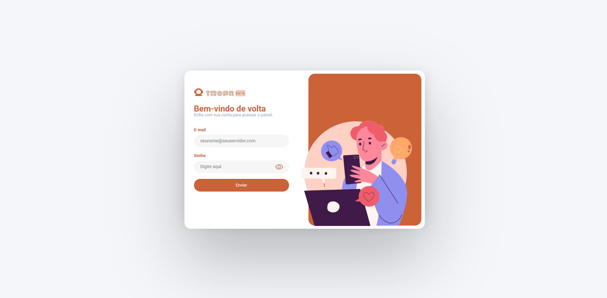
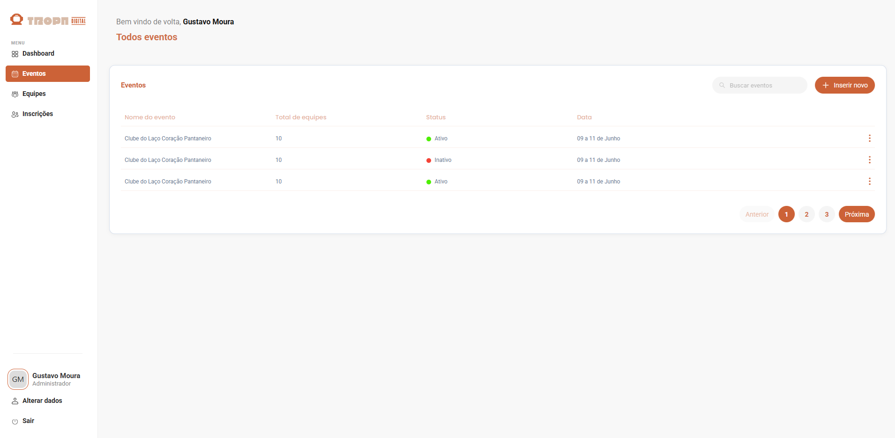

# Teste prático - Agência Tropa Digital

Este projeto foi desenvolvido como parte de um teste prático para a agência Tropa Digital.

Link no Vercel: https://front-tropadigital.vercel.app/

## Tecnologias utilizadas

- **React + TypeScript**
- **styled-components**
- **react-router-dom**

## Funcionalidades e etapas

### 1. Gerenciamento de Rotas

- **/login**: Página de login.
- **/menu/events**: Página de eventos.
- **Qualquer outra rota**: Redireciona para uma página 404, que automaticamente redireciona para o login após 3 segundos.

### 2. O que está no projeto?

- Responsividade para diferentes tamanhos de tela e mobile.
- Gerenciamento de rotas utilizando `react-router-dom`.
- Componentes estilizados com `styled-components`.

---

## Prints das páginas

